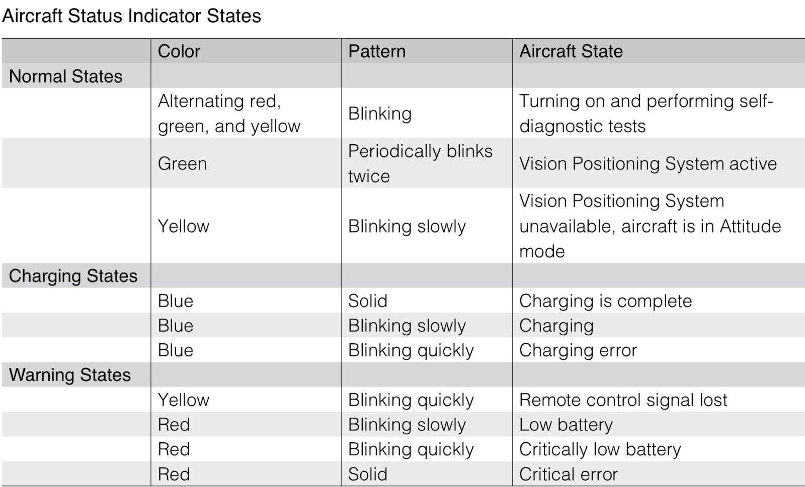
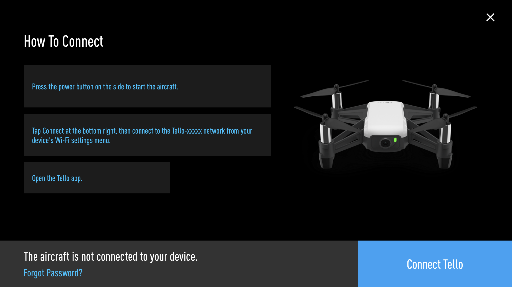
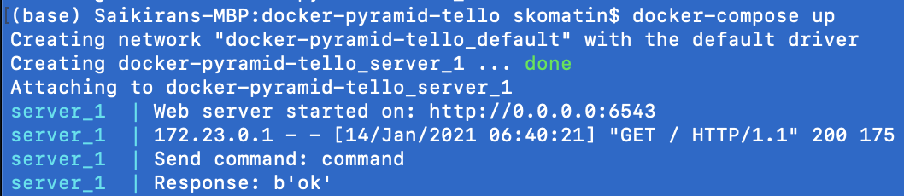
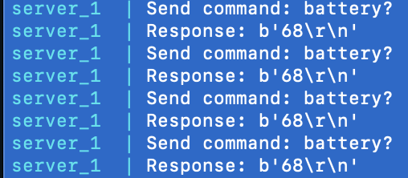

# Lab 2 Hello Tello

## Expectations

Now that you are familiar with Python and Docker, it is time to get familiar with the Tello Drone. The goal of this lab to program the Tello Drone using python and display the information in real-time. At the end, you will build a simple script to make the drone to follow a specified path. 

You will need to have access to a Tello Drone in order to complete this lab. If you have not already purchased it, you can do so from this [link](https://smile.amazon.com/Tello-CP-PT-00000252-01-Quadcopter-Drone/dp/B07BDHJJTH).

### Note
- There are many open source API's to work with Tello SDK. We will be using [DJITelloAPI](https://github.com/damiafuentes/DJITelloPy) for this class. Another option is [easyTello](https://github.com/Virodroid/easyTello)
- Tello flight time is relatively short, make sure to charge your batteries when the drone is not in use
- When connected to the Tello access point, you will not be able to connect to the internet unless you are using a [wifi dongle](https://smile.amazon.com/TP-Link-Mini-Wireless-Supports-10-9-10-14/dp/B07PB1X4CN).
- When in flight, Tello automatically lands if no command is received for 15 seconds



### Resources
- [DJITelloAPI github page](https://github.com/damiafuentes/DJITelloPy)
- [DJITelloAPI API reference](https://djitellopy.readthedocs.io/en/latest/tello/#djitellopy.tello.Tello.get_frame_read)
- [Tello SDK](https://terra-1-g.djicdn.com/2d4dce68897a46b19fc717f3576b7c6a/Tello%20编程相关/For%20Tello/Tello%20SDK%20Documentation%20EN_1.3_1122.pdf)
- [User Manual](https://terra-1-g.djicdn.com/2d4dce68897a46b19fc717f3576b7c6a/Tello%20编程相关/For%20Tello/Tello%20SDK%20Documentation%20EN_1.3_1122.pdf)

### Be Careful -- A Few Words of Caution
- Do not send the takeoff command when charging the drone 
- Avoid flying the drone near any objects that can fit between the propeller guards (eg: cables)
- Make sure to include time.sleep(x) commands between consecutive control commands (x represents the amount of time to sleep)

**If you are stuck on any parts of this lab, please do not hesitate to ping the instruction team via either email or Slide Space discussion.**

### Objectives

<ol>
<li>Initialize Tello object and its properties</li>
<li>Complete basic flight patterns: </li>
<ol>
    i.   Takeoff/land</br>     
    ii.  Move left/right/forward/backward</br> 
    iii. Rotate clockwise/anti-clockwise</br> 
    iv.  Stream video</br> 
    v.   Flip</br> 
    vi   Fly on a curve</br> 
    vii. Navigate to provided 3D coordinates</br> 
</ol>
<li>Get and display Tello state information</li>
<ol>
    i.   Speed</br>     
    ii.  Battery Percentage</br> 
    iii. Time</br> 
    iv.  Height</br> 
    v.   Temperature (°C)</br> 
    vi   Attitude (pitch/roll/yaw)</br> 
    vii. Barometer values</br> 
    viii. Acceleration </br>
    ix.   TOF (time-of-flight distance) (cm)</br>
    x.    Wifi SNR (signal strength) </br> 
</ol>
</ol>

## Let's get started

### Flying the drone with your phone

1. Install the Tello app on your phone ([ios](https://apps.apple.com/us/app/tello/id1330559633)/[android](https://play.google.com/store/apps/details?id=com.ryzerobotics.tello&hl=en_US&gl=US))
2. Follow the on-screen instructions on the to connect your phone to the drone

3. Practice Flying the drone in an indoor environment

### Communicating with the drone through Docker

#### Setting up - Windows
Follow these steps if you are using a windows platform.
1. Turn on your drone and connect to its wifi network
2. Press WIN key + S
3. Start typing "network"
4. Click "Show Available Networks"
5. Click "Properties" for the Tello connection
6. Click private under "Network Profile"

#### Building and Running the provided container image
In this lab we will be programming in python to control the drone. As before you will be running this in a dockerized environment. We have provided you with the necessary files to get you started.

1. In the current directory (where *docker-compose.yml* file is located), run the command `docker-compose  build` to download all necessary resources and build the container image.
2. Next, turn on your Tello drone and connect your computer to the Tello wifi (**Caution:** You may lose access to the internet). 
3. In the same directory, run `docker-compose up` to run the container

That's it! What we just did is build and run a docker container image using the [docker-compose](https://docs.docker.com/get-started/08_using_compose/) feature. On your terminal you should see something like this: 


(**Caution:** the drone will now take off and hover for 5 seconds, then land) Open your web browser and go to the url *http://0.0.0.0:6543* After a few seconds, you should see a simple HTML page displaying real-time camera feed from your Tello drone. 

You should also be seeing the battery status being printed to the terminal. 


### Programming Examples
In This section we will review some basic examples of how to program the drone for some simple operations. You are not required to run these, but they will help when you write your own code in the Challenge section. 

#### Example 1 
 This example shows how a tello object can be initialized and connected to. In the output, you can see the response from the drone. (Your drone may be at a different battery level). 

```python
from djitellopy import Tello        #Import djitello package

myTello = Tello()                   #Instantiate a Tello Object
myTello.connect()                   #Connect to the drone
print(myTello.get_battery())        #Print the current battery percentage
```

Output:
```
Send command: command
Response: b'ok'
Send command: battery?
Response: b'89\r\n'
89
```

#### Example 2
In this example, the drone will take off, move in the specified direction and then land. Pay close attention to the units for each movement. If you are ever unsure, always refer to the [API documentation](https://djitellopy.readthedocs.io/en/latest/tello/#djitellopy.tello.Tello.get_frame_read) 

```python
from djitellopy import Tello        #Import djitello package
from time import sleep              #Import built-in time package 

myTello = Tello()                   #Instantiate a Tello Object
myTello.connect()                   #Connect to the drone

myTello.takeoff()                   #Drone will take off ~0.5m above ground
sleep(2)                            #Sleep for 2 seconds
myTello.rotate_clockwise(90)          #Rotate 90° clockwise
sleep(2)                            #Sleep for 2 seconds
myTello.move_forward(100)             #Move 100cm forward

myTello.land()                      #Drone will land
```

#### Example 3
In this example we will learn how to display live camera feed. It will be displayed in a spereate window. Note that this code is not meant to be run in a jupyter notebook and is only included here to show you the steps. 

```python
from djitellopy import Tello            #Import djitello package
import cv2                              #Import OpenCV package 

myTello = Tello()                       #Instantiate a Tello Object
myTello.connect()                       #Connect to the drone

myTello.streamon()                      #Turn on drone camera stream

while True:
    img = cv2.get_frame_read().frame    #Get current camera frame as a BackgroundFrameRead object
    img = cv2.resize(img, (360, 240))   #Resize the image
    cv2.imshow("Camera Feed", img)      #Display the image
    cv2.waitKey(1)                      #Diaplay the current frame for 1ms 
```

### Challenge 1
Now it's your turn to write some code and get your hands dirty. Your first task is to fly the drone following a square of length 100cm in the anti-clockwise direction. Essentially, the drone will need to takeoff, follow a square and land once it returns to its original position.   

### Challenge 2

Your next task is to fly the drone in the specified path below while displaying - **in real-time** - camera feed and all 10 Tello state properties listed under bullet point 3 in the [Objectives section](#Objectives) above. Note that the drone starts and ends at the same point with the same orientation. 

<ol>
<li> Takeoff
<li> Move forward for 100cm
<li> Rotate counter clockwise by 45°
<li> Move forward for 100cm
<li> Rotate counter clockwise by 70°
<li> Left flip
<li> Move down 50cm
<li> Right flip
<li> Right flip
<li> Move backward for 75cm
<li> Back flip
<li> Fly on a curve - of your choice - back to the starting point
<li> Rotate to orient drone to initial direction 
<li> Land
</ol>

You will only be modifying **dronecamera.py**. You will find 2 code blocks indicating where you need to add your code. Code to get drone state should be added to the *getDroneState* function and code to move the drone in the specified path must be added to the *move* function. It is sufficient to print the drone state to terminal. 

### Submission
You must record your screen while displaying the camera feed in the browser and the drone states printed to terminal in **real-time**. Please make sure to follow these steps in order (for each challenge):
1. Start recording your full computer screen 
2. Run docker-compose up
3. Open http://0.0.0.0:6543
4. The drone should now takeoff and start following the specified path

Once you have 2 recordings (1 for each challenge), combine them into 1 video. Please make sure that both the browser and the terminal are visible in your recordings.

**Please push your code to github and upload your combined video to canvas. Please make sure that your combined video is not longer than 3 minutes.**

**Please Submit your work no later than Jan 21 9:00 p.m.**

Good Luck!! 